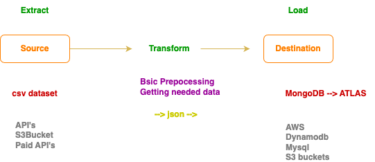
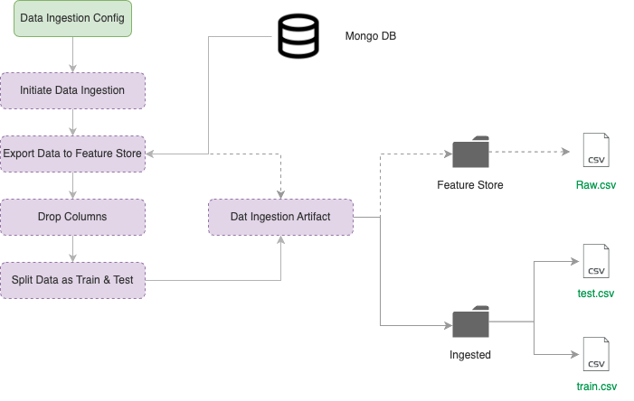

# Project Phishing Attack Detection

This project is an end-to-end Machine Learning pipeline designed to detect phishing attacks by analyzing the characteristics of URLs and web pages. It encompasses the steps of extraction, transformation, loading (ETL), ingestion, validation, data transformation, model training, and deployment, with an API built using FastAPI for easy access to the model's predictions.

## Technologies Used

*   **FastAPI:** To create a robust and efficient API for serving model predictions.
*   **Docker:** For containerizing the application, ensuring reproducibility and portability.
*   **CI/CD:** For automating the development and deployment pipeline, enabling fast and reliable updates.
*   **GitHub Actions:** For orchestrating the CI/CD process, automating testing, building, and deployment.
*   **AWS:**
    *   **S3:** For storing raw data, artifacts, and trained models.
    *   **ECR:** For storing Docker images.
    *   **EC2:** For running the deployed application. (Alternatively, AWS App Runner can be used for simpler deployment.)
*   **MongoDB:** For storing preprocessed and transformed data.

## Key Stages

1.  **Data Extraction (Extract):**
    *   Source: CSV file containing a dataset of URLs and their associated features.
    *   Objective: Retrieve the raw data from the phishing dataset.

2.  **Data Transformation (Transform):**
    *   Objective: Clean, preprocess, and prepare the data for loading. 
        

3.  **Data Loading (Load):**
    *   Destination: MongoDB database.
    *   Objective: Store the transformed data in a database for easy access.

  

4.  **Data Ingestion:**
    *   Source: MongoDB
    *   Objective: Load data from MongoDB for validation and transformation steps in preparation for training.

  

5.  **Data Validation:**
    *   Objective: Ensure data quality and detect potential problems that could affect model performance.
    *   Steps:
        *   Schema validation (ensuring the same number of features).
        *   Data drift detection to ensure that the training and inference data follow a similar distribution.
    *   Output: Data Validation Artifacts, indicating the validation status.

6.  **Data Transformation:**
    *   Objective: Prepare the data for model training by applying scaling or encoding transformations.
    *   Steps:
        *   [Replace this item and describe the specific transformations applied to the features, e.g., StandardScaler for scaling, OneHotEncoder for categorical variables, etc.]
    *   Output: Data Transformation Artifacts, containing the transformed data and the processor.pkl object needed to apply the same transformations to new data.

7.  **Model Training (Model Trainer):**
    *   Objective: Train a Machine Learning model to predict whether a URL is a phishing attack or not.
    *   Algorithms Tested:
        *   RandomForestClassifier
        *   DecisionTreeClassifier
        *   GradientBoostingClassifier
        *   LogisticRegression
        *   AdaBoostClassifier
    *   Optimization Method: Hyperparameter tuning with GridSearchCV to find the best combination of hyperparameters for each model.
    *   Objective: Select the best model based on performance metrics (e.g., precision, recall, F1-score) on a validation set.

8.  **Deployment:**
    *   Objective: Make the trained model accessible for detecting phishing attacks in real-time via a FastAPI API.

## Architecture

mettre un diagrame
